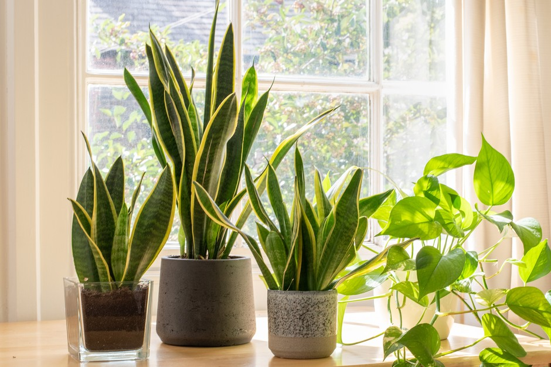
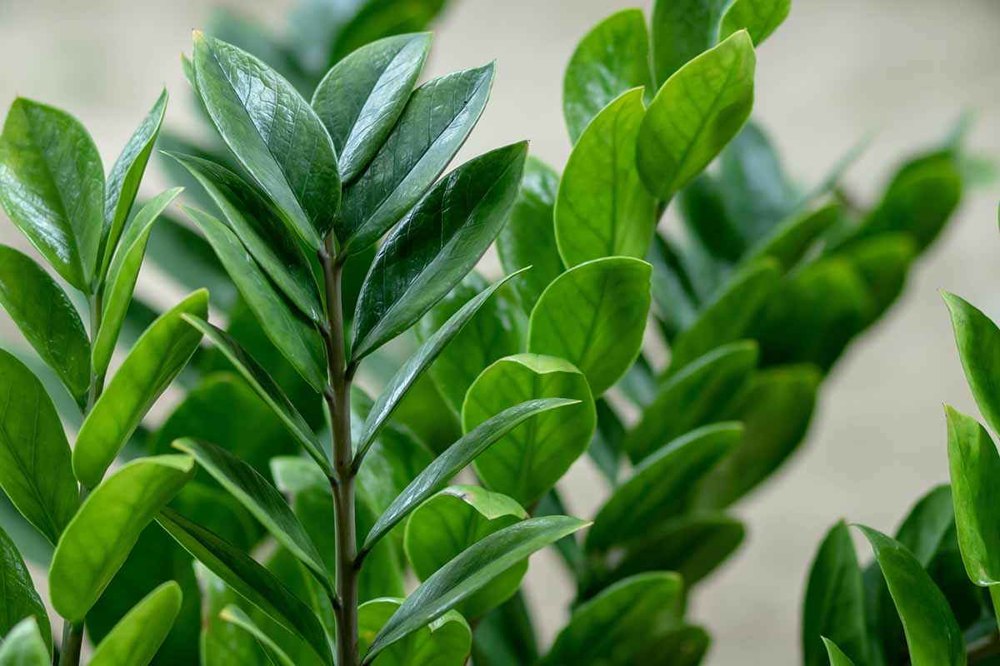
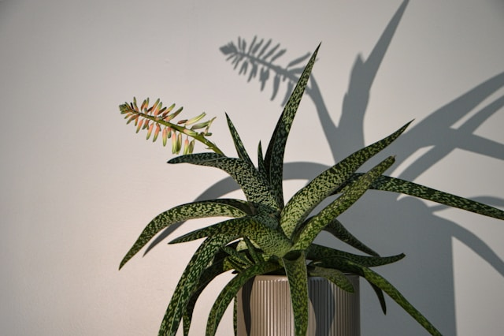
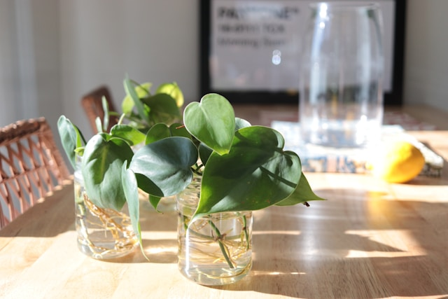
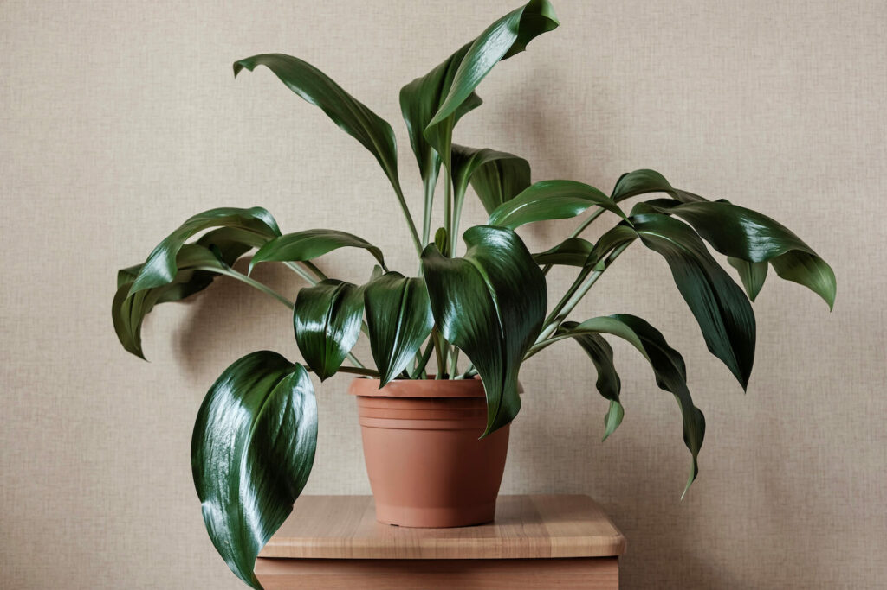
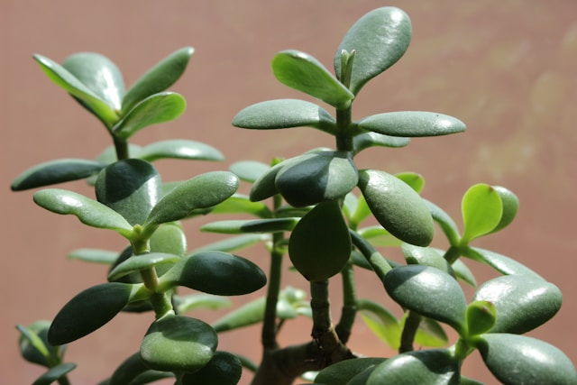
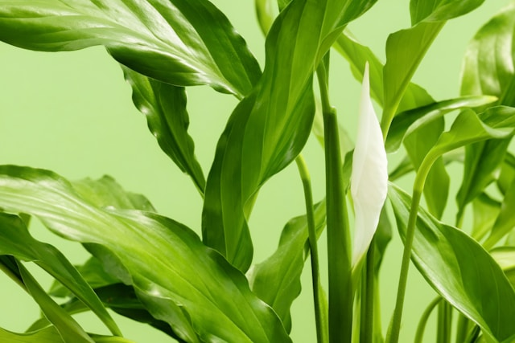

Houseplants are beautiful — until they’re crispy, droopy, or covered in something suspicious.

If you’ve ever had a plant turn sad on you (RIP to that one fern), this post is for you. Whether you're forgetful, busy, or just starting out, these low-maintenance houseplants can handle a little neglect and still thrive.

## 🌿 1. Snake Plant *(Sansevieria)*

This one’s basically indestructible. Snake plants tolerate low light, dry air, and irregular watering. In fact, overwatering is the most common way people kill them.

**Care Tips:**
- Light: Bright to low light
- Water: Every 2–3 weeks
- Bonus: They look sleek and sculptural in any space.

---

## 🪴 2. ZZ Plant *(Zamioculcas zamiifolia)*

ZZ plants have thick, waxy leaves that hold water well. They thrive on neglect and don’t mind dark corners or missed waterings.

**Care Tips:**
- Light: Low to medium light
- Water: Every 2–4 weeks
- Bonus: Glossy leaves that always look clean.

---

## 🌵 3. Aloe Vera

Aloe isn’t just easy — it’s useful. Snap off a leaf to soothe minor burns or skin irritation. It loves sunshine and doesn’t need much else.

**Care Tips:**
- Light: Bright, direct light
- Water: Every 2–3 weeks
- Bonus: Dual-purpose and drought-resistant.

---

## 🌱 4. Pothos *(Epipremnum aureum)*

Pothos are fast-growing, forgiving vines that thrive in all kinds of conditions. They’re ideal if you like something trailing off a shelf.

**Care Tips:**
- Light: Low to bright, indirect
- Water: Once a week (or less)
- Bonus: Super easy to propagate.

---

## 🪴 5. Cast Iron Plant *(Aspidistra elatior)*

True to its name, this plant is tough. It tolerates low light, inconsistent watering, and even cold drafts.

**Care Tips:**
- Light: Low to medium
- Water: Every 2–3 weeks
- Bonus: Large, dark green leaves that rarely get pests.

---

## 🌵 6. Jade Plant *(Crassula ovata)*

This cute succulent looks like a mini tree and can live for decades. It doesn't need much — just occasional watering and some light.

**Care Tips:**
- Light: Bright, indirect
- Water: Every 2–4 weeks
- Bonus: Considered lucky in many cultures.

---

## 🍃 7. Peace Lily *(Spathiphyllum)*

Despite its elegant blooms, this plant is shockingly low-effort. It droops when thirsty — so it basically tells you when to water.

**Care Tips:**
- Light: Low to medium
- Water: About once a week
- Bonus: Occasional white flowers and air-purifying properties.

---

## 🌸 Final Thoughts

Not every plant wants to be fussed over. If you’re the type who forgets to water or travels often, these forgiving houseplants will be your new best friends.

Start with one, see how it goes, and build your indoor garden from there. You don’t have to be perfect — you just have to enjoy the process.

*Have a favorite low-maintenance plant that’s not on the list? Let me know in the comments or tag @monoflora.blog on Instagram!*

