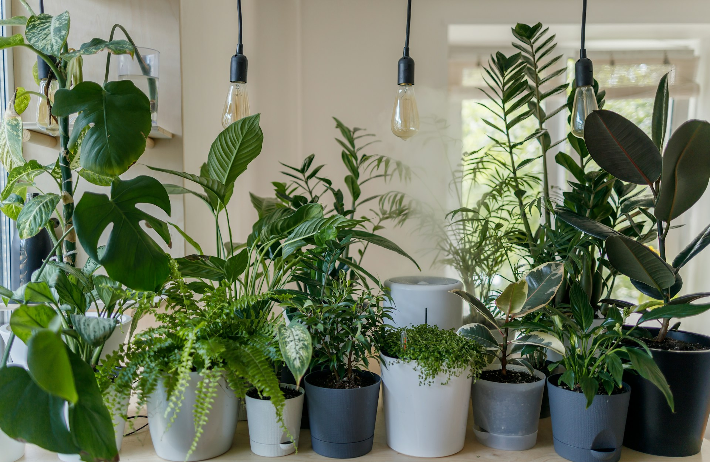
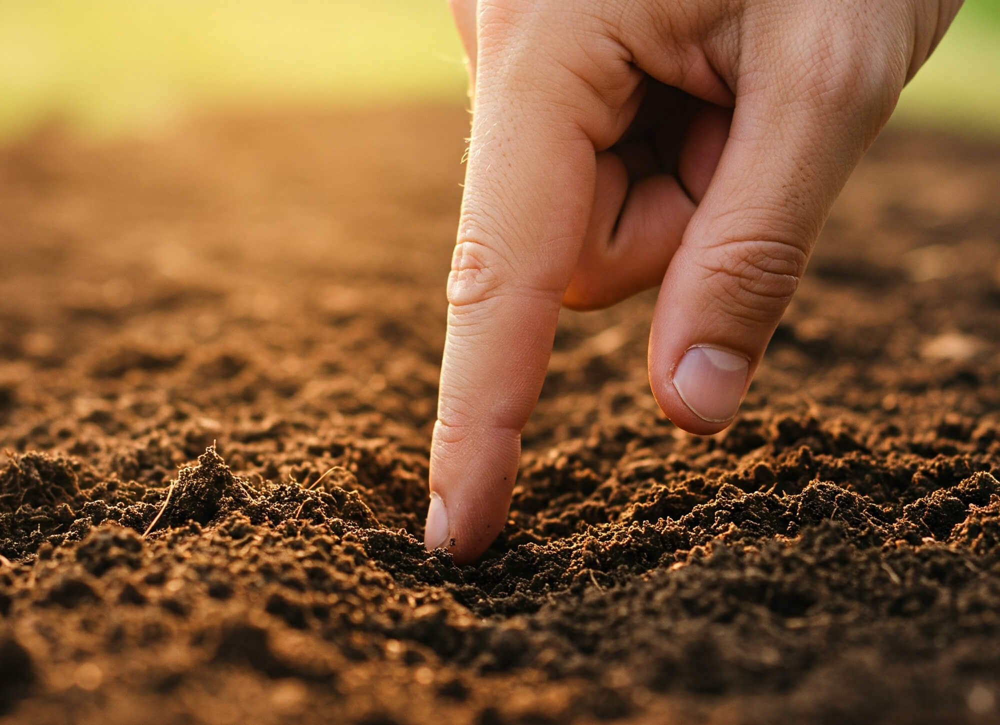
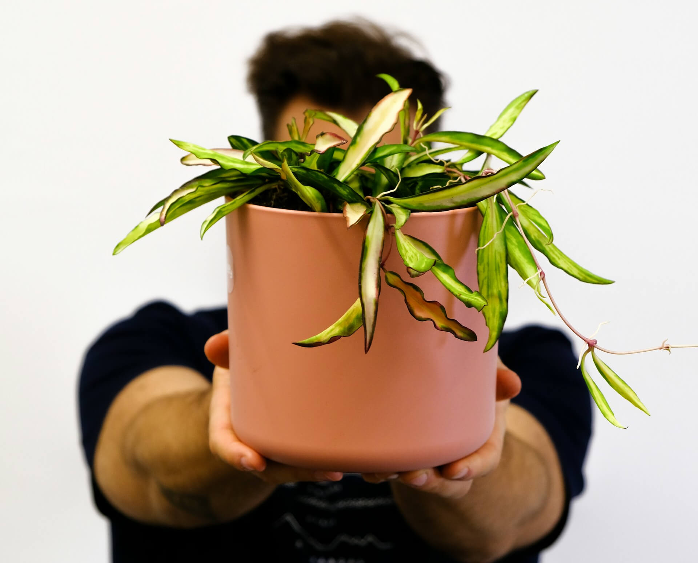

"How often should I water my houseplants?" It's probably the single most common question new (and even experienced!) plant parents ask. You might have heard "once a week," but spoiler alert: **there's no magic number!** Watering frequency is less about a strict calendar schedule and more about understanding your plant's specific needs and environment.

Getting watering right is crucial. While estimates vary, many plant experts agree that **overwatering is the leading cause of houseplant death**, leading to dreaded root rot. But underwatering isn't great either! Let's dive into how to determine the perfect watering routine for your green companions.

## Why the "Once a Week" Rule Fails

Imagine telling every person you know to drink exactly eight glasses of water a day, regardless of whether they just ran a marathon or spent the day relaxing in air conditioning. Sounds silly, right? It's the same for plants!

A thirsty fern in a sunny window during summer needs vastly different amounts of water compared to a snake plant in a cool, dim corner during winter dormancy. A fixed schedule ignores all the crucial variables that affect how quickly a plant uses water and how fast the soil dries out.

## Factors Influencing Watering Needs 🌱

So, if not a schedule, what *does* determine when to water? Several factors come into play:

1.  **Plant Type:** This is a big one!
    * **Succulents & Cacti:** Store water in their leaves/stems. They prefer their soil to dry out completely between waterings.
    * **Tropical Plants (e.g., Ferns, Calatheas):** Often prefer consistently moist (but not soggy) soil.
    * **Average Foliage Plants (e.g., Pothos, Monsteras):** Usually like the top inch or two of soil to dry out before getting more water.

2.  **Pot Size and Material:**
    * **Size:** Smaller pots dry out much faster than larger ones.
    * **Material:** Porous materials like terracotta wick moisture away from the soil, causing it to dry faster than non-porous materials like plastic or glazed ceramic. Drainage holes are essential regardless of material!

     dry out faster than plastic pots (left) | Image by Huu Thong")

3.  **Light Levels:** Plants in bright, direct light photosynthesize more actively and use water more quickly than plants in low-light conditions.

4.  **Temperature & Humidity:** Higher temperatures and lower humidity lead to faster evaporation from the soil and transpiration from the leaves, increasing water needs.

5.  **Season:** Most houseplants have active growing periods (spring/summer) and dormant periods (fall/winter). They need significantly less water during dormancy when growth slows down.

6.  **Soil Type/Mix:** Well-draining mixes (often containing perlite, bark, etc.) dry out faster than dense, heavy soils that retain a lot of moisture.

## The Best Way to Check: Get Your Fingers Dirty! 👇

The most reliable way to know if your plant needs water is to check the soil moisture level directly.

**The Finger Test:**

1.  Gently insert your index finger into the soil, aiming to go about 1-2 inches deep (up to your first or second knuckle).
2.  **Feel the moisture:**
    * **Feels Wet/Muddy:** Definitely wait longer. Too much water.
    * **Feels Cool & Slightly Moist:** Probably okay for most plants, but check again soon. For succulents, wait longer.
    * **Feels Dry & Crumbly:** It's likely time to water for most foliage plants!

## Other Checking Methods (Optional but Useful)

* **Pot Weight:** Learn how heavy the pot feels right after watering versus when it's dry. A significantly lighter pot often means it's time for a drink. This works best for smaller to medium-sized pots you can easily lift.
* **Soil Moisture Meter:** These gadgets can be helpful, especially for larger pots. Insert the probe into the soil (clean it between uses!). However, be aware that their accuracy can vary depending on the soil type and meter quality. Don't rely on them exclusively; combine with the finger test occasionally.
* **Visual Cues:** Drooping or wilting leaves *can* indicate thirst, but they can *also* be a sign of overwatering (due to root rot preventing water uptake) or other stress. Relying solely on wilting isn't ideal, as it means the plant is already stressed. Yellowing leaves are more often a sign of overwatering than underwatering.

## Common Watering Mistakes to Avoid 🚫

* **Overwatering:** The #1 killer! Allowing soil to stay constantly soggy drowns the roots, depriving them of oxygen and inviting fungal diseases (root rot). Always ensure pots have drainage holes.
* **Underwatering:** While less immediately fatal than overwatering for many plants, chronic underwatering stresses the plant, leading to brown tips, crispy leaves, and stunted growth.
* **Watering on a Strict Schedule:** As discussed, ignore the calendar and check the soil!
* **Using Water That's Too Cold/Hot:** Room temperature water is generally best. Very cold water can shock the roots.
* **Letting Pots Sit in Drainage Water:** After watering thoroughly (until water runs out the bottom), empty the saucer or cache pot after 15-30 minutes. Plants sitting in water is a recipe for root rot.
* **Shallow Watering:** Give the plant a good soak so water reaches the entire root ball, not just a little splash on top.

## Exceptions & Special Cases ✨

* **Succulents & Cacti:** Water thoroughly, but only when the soil is bone dry throughout the pot. Reduce watering drastically in winter.
* **Air Plants (Tillandsia):** No soil! They are typically soaked in water for 20-60 minutes every 1-2 weeks (depending on type and environment) and/or misted regularly. Allow them to dry completely upside down after soaking.
* **Self-Watering Pots:** These have reservoirs. Follow the manufacturer's instructions, but still periodically check the topsoil moisture and ensure the system isn't keeping the soil constantly waterlogged.

## Conclusion: Listen to Your Plants! 💚

Stop stressing about watering!