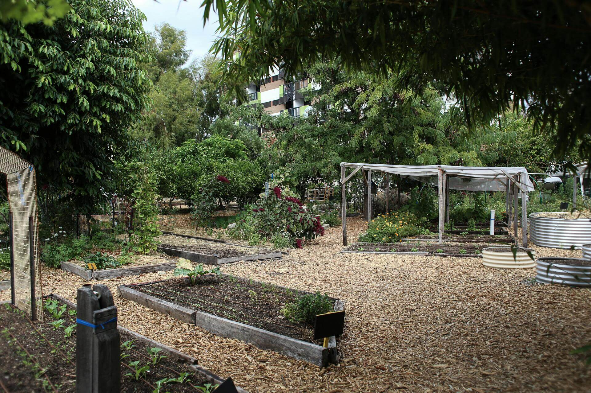
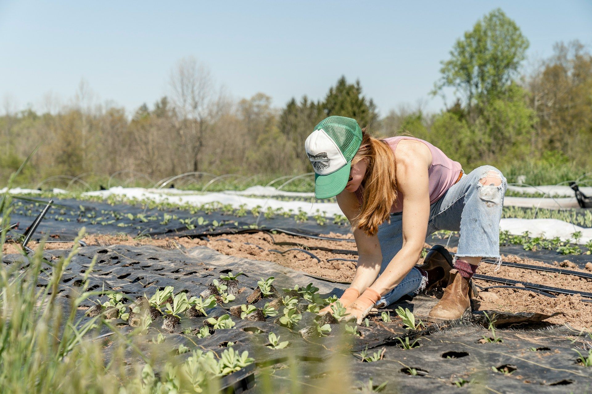
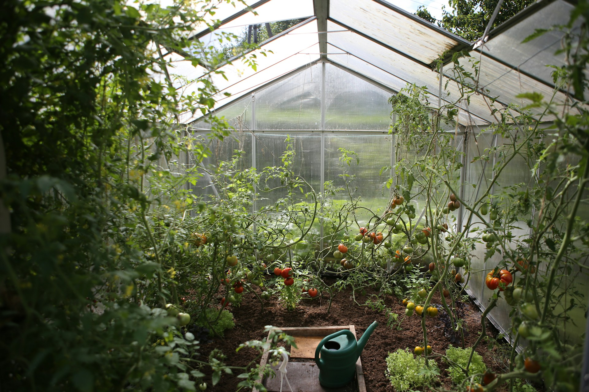

Welcome to our in-depth guide on **Organic vs. Conventional Gardening**. In this article, we'll explore the differences between these two popular gardening practices, discuss their benefits and challenges, and provide practical tips for gardeners looking to choose or blend both approaches. Whether you're new to gardening or a seasoned horticulturist, you'll find valuable insights to help you create a thriving garden.

## Understanding the Two Approaches

Gardening methods can broadly be divided into organic and conventional techniques. This section outlines the core principles and differences between the two.

### What is Organic Gardening?

Organic gardening emphasizes the use of natural substances and processes to cultivate healthy plants. It avoids synthetic fertilizers and pesticides, focusing instead on:
- **Natural soil enrichment:** Using compost, green manure, and organic mulches.
- **Pest management:** Relying on beneficial insects, crop rotation, and natural remedies.
- **Sustainability:** Creating a balanced ecosystem that nurtures both plants and the environment.

### What is Conventional Gardening?

Conventional gardening, on the other hand, often involves the use of synthetic chemicals to boost growth and manage pests. Key characteristics include:
- **Chemical inputs:** Utilization of synthetic fertilizers, herbicides, and pesticides.
- **Higher yields:** Often focused on maximizing production, especially in large-scale operations.
- **Quick results:** The use of fast-acting solutions to combat pests and nutrient deficiencies.

## Comparing Organic and Conventional Methods

To better understand these methods, consider the following key aspects:

1. **Soil Health:**
   - *Organic:* Enhances long-term soil fertility through natural amendments.
   - *Conventional:* May rely on chemical fertilizers that provide quick results but can lead to soil degradation over time.

2. **Pest Control:**
   - *Organic:* Uses integrated pest management (IPM) techniques and encourages beneficial organisms.
   - *Conventional:* Uses chemical pesticides that can be effective but might disrupt local ecosystems.

3. **Environmental Impact:**
   - *Organic:* Focuses on reducing environmental pollution and supporting biodiversity.
   - *Conventional:* Can have a higher environmental footprint due to synthetic chemicals.

4. **Yield and Efficiency:**
   - *Organic:* Often produces lower yields initially but aims for sustainability.
   - *Conventional:* Typically achieves higher yields, especially in commercial agriculture.

## Practical Tips for Implementing Both Approaches

Many gardeners are exploring a hybrid approach that combines the best of both worlds. Here are some practical tips:

- **Start with a Soil Test:**  
  Assess your soil’s nutrient levels and structure to determine which amendments are needed. Organic compost can improve soil health, even in conventional systems.

- **Integrated Pest Management (IPM):**  
  Combine natural pest control methods with targeted chemical treatments when necessary. This minimizes harm to beneficial insects while protecting your plants.

- **Experiment with Crop Rotation:**  
  Rotate crops to naturally reduce pest populations and maintain soil fertility. Both organic and conventional gardens can benefit from this practice.

- **Monitor and Adapt:**  
  Keep a garden journal to track the effectiveness of your practices. Regularly adjust your approach based on plant performance and seasonal changes.

## Conclusion and Next Steps

Organic vs. conventional gardening presents a fascinating debate, with each approach offering distinct advantages and challenges. By understanding these differences, you can tailor your gardening practices to suit your needs, environment, and philosophy. Whether you choose to go fully organic, stick with conventional methods, or combine both strategies, the key is to stay informed and adaptable.

We invite you to share your experiences and insights in the comments below. Which methods have worked best for you? And how do you plan to experiment with your garden this season? Explore our other articles for more tips on sustainable gardening and innovative plant care techniques.

*Happy gardening!*
