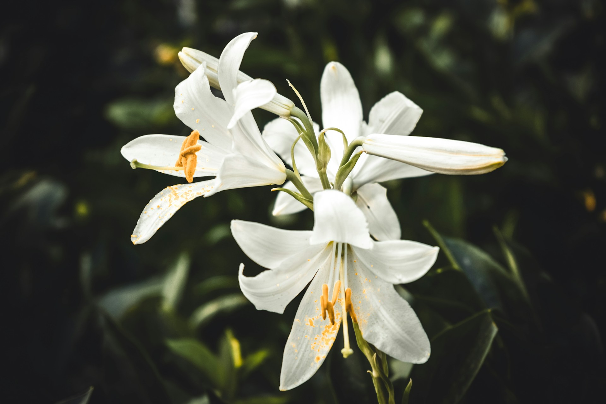
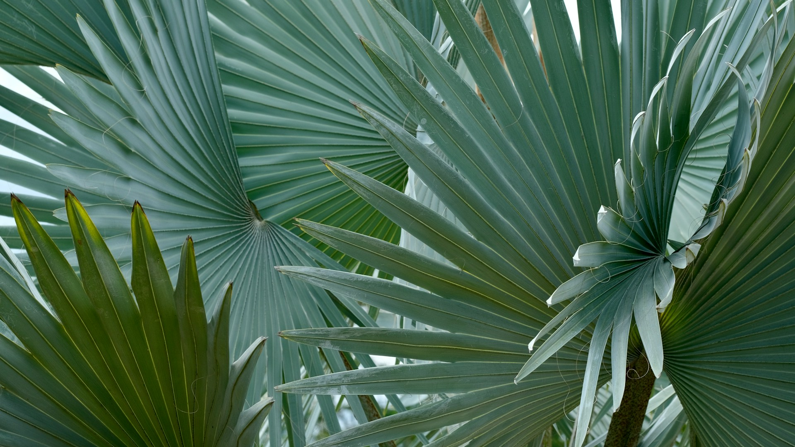
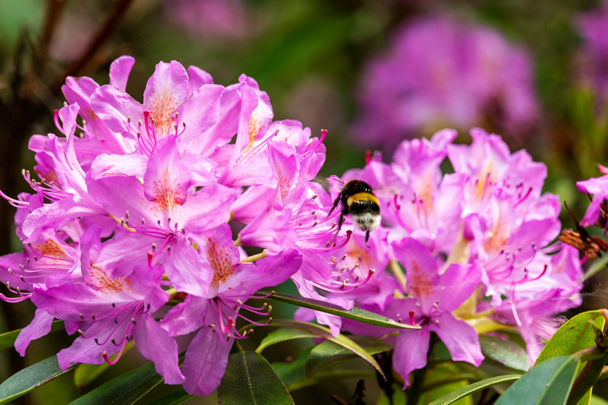
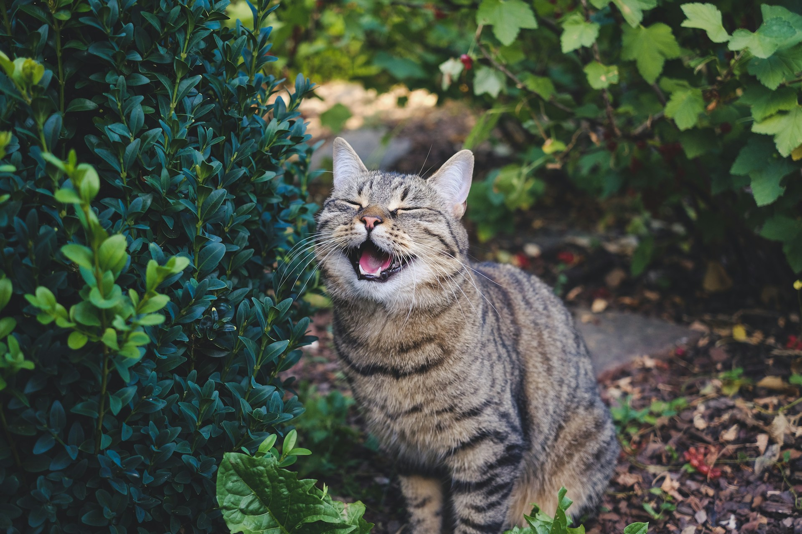

As plant lovers and cat owners, we strive to create a harmonious environment where both our green beauties and furry companions can thrive. However, a surprising number of common ornamental plants can pose a serious threat to our inquisitive feline friends. Cats, especially young kittens, are notorious for exploring their surroundings with their mouths, and a nibble of the wrong leaf or flower can lead to anything from mild discomfort to severe illness, or even fatality.

This guide will walk you through some of the most common plants that are poisonous to cats, help you identify the signs of poisoning, and offer tips on creating a cat-safe garden and home.

## Why Are Some Plants Poisonous to Cats?

Plants produce a wide array of chemical compounds for various purposes, including defense against herbivores. These compounds, such as alkaloids, glycosides, oxalates, and resins, can interfere with a cat's normal bodily functions when ingested. A cat's metabolism is different from a human's, and they lack certain liver enzymes that help process these toxins, making them particularly vulnerable.

## Common Culprits: Plants to Keep Away From Cats

It's crucial to be able to identify plants that could harm your cat. Here are some of the most frequently encountered culprits, both indoors and out:

### 1. Lilies (Lilium and Hemerocallis species)

Perhaps the most notorious group of plants for cat toxicity are true lilies (species in the *Lilium* genus, e.g., Easter lilies, Stargazer lilies, Tiger lilies) and daylilies (*Hemerocallis* species).

* **Toxic Parts:** All parts of the plant are highly toxic, including the pollen and even the water in the vase.
* **Symptoms:** Ingesting even a small amount can cause severe kidney failure within 24-72 hours. Early signs include vomiting, lethargy, and loss of appetite. Without prompt and aggressive veterinary treatment, the prognosis is often poor.
* **Action:** If you suspect your cat has ingested any part of a lily, seek veterinary care *immediately*.

### 2. Sago Palm (Cycas revoluta)

Sago palms are popular ornamental plants, often found in warmer climates or as houseplants. Despite their attractive appearance, they are extremely dangerous to pets.

* **Toxic Parts:** All parts are toxic, but the seeds (or "nuts") contain the highest concentration of the toxin cycasin.
* **Symptoms:** Vomiting, diarrhea (often bloody), jaundice, liver damage, liver failure, and potentially death. Symptoms can appear within 15 minutes to several hours after ingestion.
* **Action:** This is a veterinary emergency. Immediate treatment is critical.

### 3. Oleander (Nerium oleander)

Oleander is a common and beautiful flowering shrub, especially in warmer regions, but it's packed with cardiac glycosides.

* **Toxic Parts:** All parts of the plant are highly toxic. Even smoke from burning oleander can be dangerous.
* **Symptoms:** Drooling, abdominal pain, vomiting, diarrhea, severe heart abnormalities (arrhythmias, slowed or racing heart rate), tremors, incoordination, and can be fatal.
* **Action:** Seek immediate veterinary attention.

### 4. Tulips and Daffodils (Tulipa and Narcissus species)

These beloved spring bulbs bring cheer to gardens, but they can cause problems for curious cats.

* **Toxic Parts:** While the entire plant contains toxins, the bulbs have the highest concentration.
* **Symptoms:** Ingestion of the foliage or flowers can cause drooling, vomiting, diarrhea, and abdominal pain. If a cat ingests a significant amount of the bulb, more severe symptoms like an increased heart rate, changes in breathing, and tremors can occur.
* **Action:** Contact your vet if you notice these signs, especially if you know your cat has access to these plants.

### 5. Azaleas and Rhododendrons (Rhododendron species)

These popular flowering shrubs contain grayanotoxins, which can affect the cardiovascular and nervous systems.

* **Toxic Parts:** All parts of the plant are considered toxic.
* **Symptoms:** Vomiting, diarrhea, drooling, weakness, incoordination, depression, tremors, and in severe cases, cardiovascular collapse and death. Symptoms usually appear within a few hours of ingestion.
* **Action:** Veterinary intervention is necessary.

### Other Notable Toxic Plants:

* **Philodendrons & Pothos (Araceae family):** Contain insoluble calcium oxalate crystals. Chewing or biting can cause intense oral irritation, pain and swelling of the mouth, tongue, and lips, excessive drooling, vomiting, and difficulty swallowing.
* **Dieffenbachia (Dumb Cane):** Similar to philodendrons, causes severe oral irritation due to calcium oxalate crystals.
* **English Ivy (Hedera helix):** Contains triterpenoid saponins. Can cause vomiting, abdominal pain, hypersalivation, and diarrhea. Foliage is more toxic than berries.
* **Peace Lily (Spathiphyllum species):** Despite its name, it's not a true lily but contains calcium oxalate crystals, causing oral irritation similar to Philodendrons.
* **Aloe Vera (Aloe barbadensis miller):** The latex (a substance found just under the plant's skin) contains saponins and anthraquinones, which can cause vomiting, diarrhea, and lethargy. The gel inside is generally considered safe in small amounts but it's best to err on the side of caution.
* **Eucalyptus:** Contains essential oils that can cause salivation, vomiting, diarrhea, depression, and weakness if ingested.

## Recognizing Symptoms of Plant Poisoning in Cats

Symptoms can vary greatly depending on the plant, the amount ingested, and the cat's individual sensitivity. However, some general signs to watch out for include:

* Vomiting (sometimes with blood)
* Diarrhea (sometimes with blood)
* Drooling or foaming at the mouth
* Difficulty swallowing
* Oral irritation or pawing at the mouth
* Loss of appetite
* Lethargy or weakness
* Pale gums
* Difficulty breathing
* Tremors or seizures
* Changes in heart rate
* Increased thirst or urination (can indicate kidney issues)
* Jaundice (yellowing of skin, gums, or whites of eyes, indicating liver issues)

## What to Do If You Suspect Your Cat Has Eaten a Poisonous Plant

1.  **Stay Calm, Act Fast:** Remove your cat from the plant immediately.
2.  **Identify the Plant:** If possible, take a sample of the plant (or a photo) with you to the vet. This can help with diagnosis and treatment.
3.  **Do NOT Induce Vomiting:** Unless specifically instructed by your veterinarian. Inducing vomiting incorrectly can cause more harm.
4.  **Contact Your Veterinarian or Pet Poison Helpline Immediately:** Time is critical. Your vet can provide specific advice and determine if emergency care is needed. Keep these numbers handy:
    * Your local veterinarian's emergency number.
    * [ASPCA Animal Poison Control Center](https://www.aspca.org/): (888) 426-4435 (a consultation fee may apply).
    * Pet Poison Helpline: (855) 764-7661 (a consultation fee may apply).
5.  **Follow Veterinary Advice:** Your vet will provide the best course of action based on the suspected toxin and your cat's condition.

## Creating a Cat-Safe Garden and Home

The best way to protect your cat is through prevention:

* **Know Your Plants:** Identify all the plants in your home and garden. Use resources like the ASPCA's toxic and non-toxic plant lists to check their safety.
* **Remove or Relocate Toxic Plants:** If you have highly toxic plants, it's best to remove them entirely. For less toxic plants, consider moving them to areas completely inaccessible to your cat (e.g., hanging baskets well out of reach, rooms your cat doesn't enter).
* **Choose Cat-Friendly Alternatives:** There are many beautiful and safe plants you can enjoy. Some popular cat-safe options include:
    * Spider Plant (*Chlorophytum comosum*)
    * Boston Fern (*Nephrolepis exaltata*)
    * Areca Palm (*Dypsis lutescens*)
    * Prayer Plant (*Maranta leuconeura*)
    * Catnip (*Nepeta cataria*)
    * Cat Grass (oat, wheat, or rye grass)
    * African Violet (*Saintpaulia*)
    * Haworthia species
* **Supervise Outdoor Time:** If your cat goes outdoors, supervise them closely or provide a secure "catio" (cat patio) to prevent them from accessing unknown or toxic plants in neighbors' yards.
* **Be Cautious with Bouquets:** Many floral arrangements contain lilies or other toxic flowers. Keep them well out of reach or opt for pet-safe arrangements.

## Conclusion: A Safe Haven for All

Creating a beautiful, plant-filled space that is also safe for our beloved feline companions is entirely achievable with a little knowledge and precaution. By familiarizing yourself with common poisonous plants and opting for cat-friendly alternatives, you can ensure your home and garden remain a joyful and hazard-free environment for everyone.

Do you have any favorite cat-safe plants, or have you had an experience with a cat and a toxic plant? Share your thoughts and tips in the comments below – let's help each other keep our furry friends safe!