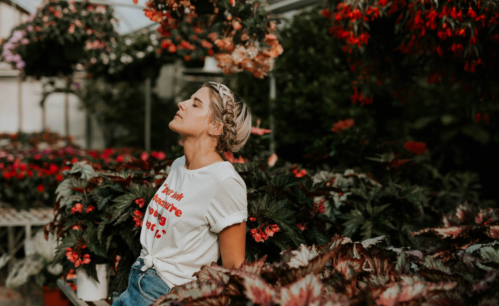
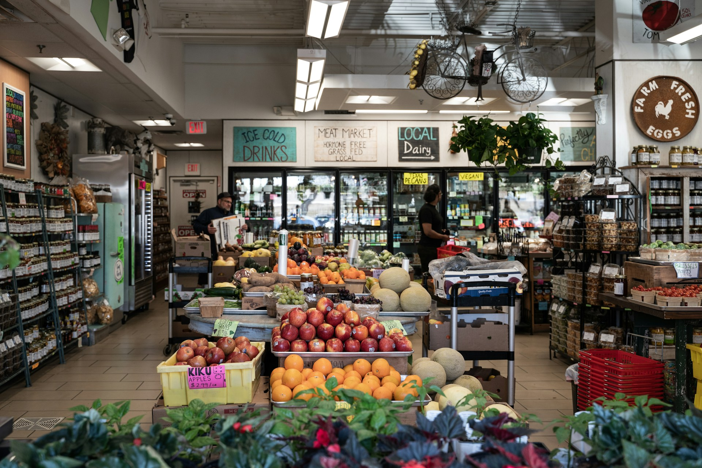
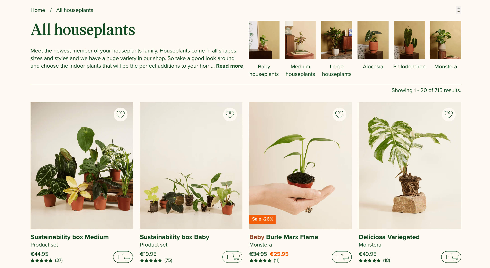
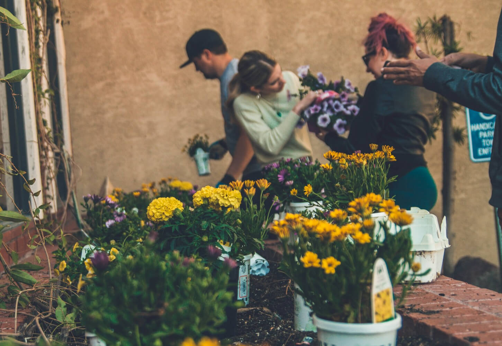
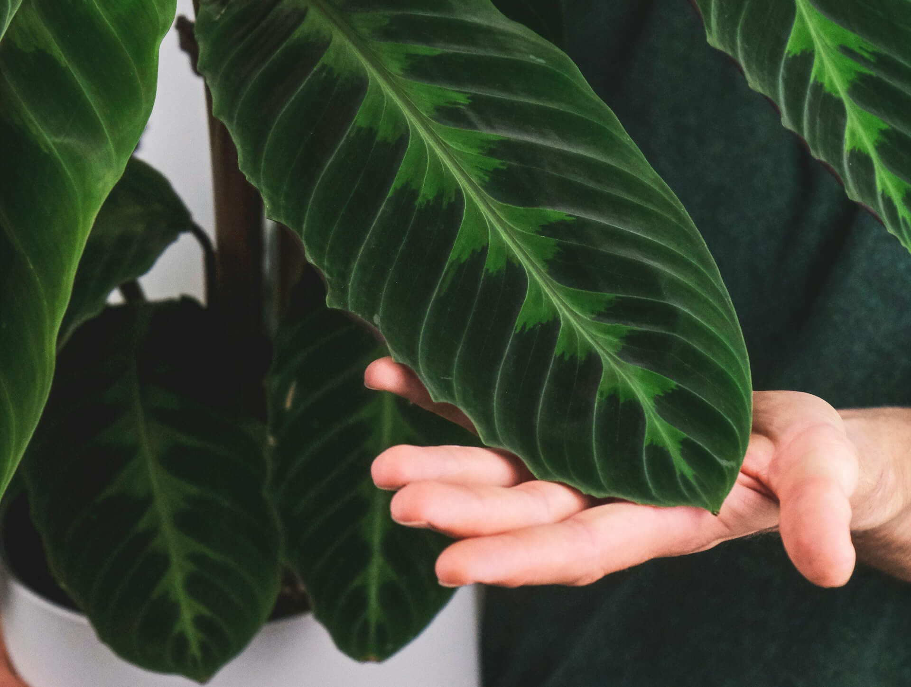

So, you've decided to bring more green into your life – fantastic! But where do you actually *get* these leafy companions? Choosing where to buy your houseplants can impact their initial health, the variety available, and your wallet. There's a surprising range of options, each with its own set of benefits and drawbacks.

Let's explore the most popular places to hunt for houseplants in the US, touch upon European options, and discuss what to look for (and look out for!) when making your purchase.

## 1. Local Independent Nurseries & Garden Centers

These are often specialized shops, sometimes family-run, focusing solely on plants, gardening supplies, and expert advice.

* **Pros:**
    * **Quality & Health:** Plants are often better cared for and healthier initially.
    * **Expertise:** Staff are usually knowledgeable plant lovers who can offer specific care advice.
    * **Unique Selection:** You might find less common or more unusual varieties here compared to big box stores.
    * **Support Local:** Buying here supports small businesses in your community.
* **Cons:**
    * **Price:** Often more expensive than other options.
    * **Selection Size:** May have a smaller overall inventory than huge chains, though it might be more curated.
    * **Convenience:** Fewer locations, might require a dedicated trip.

## 2. Big Box Stores (e.g., Home Depot, Lowe's, Walmart, IKEA)

These large retail chains often have dedicated garden sections, especially seasonally. IKEA is also known for its selection of trendy, affordable houseplants.

* **Pros:**
    * **Price:** Generally offer lower prices and frequent sales/clearances.
    * **Convenience:** Numerous locations, easily accessible during other shopping trips.
    * **Common Varieties:** Good source for popular, easy-care houseplants.
* **Cons:**
    * **Inconsistent Care:** Plants may be stressed due to variable watering, lighting, and handling. Inspect carefully!
    * **Pest Potential:** Higher volume and less specialized care can increase the risk of bringing home pests. (Quarantine is key!)
    * **Limited Expertise:** Staff knowledge about specific plant care can be minimal.
    * **Selection:** Mostly common varieties; less likely to find rare or collector plants.

## 3. Grocery Stores & Supermarkets (e.g., Trader Joe's, Whole Foods)

You might be surprised to find small potted plants, often orchids, succulents, or popular foliage plants, near the floral section of your grocery store.

* **Pros:**
    * **Convenience:** Extremely convenient – grab a plant with your groceries.
    * **Price:** Often very affordable, sometimes surprisingly cheap.
    * **Impulse Buys:** Great for a quick pick-me-up or a simple gift.
* **Cons:**
    * **Very Limited Selection:** Usually just a few common types.
    * **Minimal Care:** Plants receive little to no specialized care in the store; quality can be highly variable. Inspect *very* thoroughly.
    * **No Expertise:** Don't expect plant care advice here.

## 4. Online Plant Shops & Marketplaces

The internet has opened up a vast world for plant buyers. This includes large dedicated online nurseries (like The Sill, Bloomscape, Rooted), specialized growers selling direct (like Logee's, Gabriella Plants), and marketplaces connecting individual sellers and small nurseries (like Etsy).

* **Pros:**
    * **Huge Selection:** Access to an enormous variety, including rare, collector, and hard-to-find plants.
    * **Convenience:** Delivered right to your door.
    * **Specialization:** Easy to find sellers focusing on specific plant types (e.g., Hoyas, Aroids).
    * **Information:** Reputable sellers often provide detailed care guides.
* **Cons:**
    * **Shipping Stress & Damage:** Plants can suffer during transit (temperature fluctuations, rough handling).
    * **Cost:** Shipping fees can add significantly to the price. Some curated sites are also premium-priced.
    * **Can't Inspect:** You buy based on photos and seller reputation, not by examining the exact plant yourself.
    * **Acclimation:** Plants may need extra time to adjust after shipping.

## 5. Plant Swaps, Social Media & Local Groups

Don't overlook community resources! Facebook Marketplace, local gardening groups, and organized plant swaps are great ways to find plants, often cuttings or divisions from fellow hobbyists.

* **Pros:**
    * **Low Cost/Free:** Often involves trading cuttings or buying established plants very cheaply.
    * **Local Acclimation:** Plants are already used to your local climate.
    * **Community:** Connect with other plant lovers in your area.
    * **Unique Finds:** Access propagated plants not typically sold commercially.
* **Cons:**
    * **Effort:** Requires finding groups/events and sometimes coordinating meetups.
    * **Pest/Disease Risk:** Inspect trades very carefully, as care histories vary. Quarantine is essential.
    * **Variable Quality:** Depends entirely on the individual seller/swapper.

## A Note on European Options 🇪🇺

The types of places to buy plants in Europe are quite similar, though the specific store names differ:

* **Local Garden Centers:** Independent shops (`Gartencenter`, `Jardinerie`, `Centrum ogrodnicze`, `Zahradnictví`) remain a top choice for quality and advice.
* **DIY/Home Improvement Stores:** Large chains like Bauhaus, Obi, Hornbach (common in Central Europe), B&Q (UK), Leroy Merlin (France, Spain, etc.) usually have significant plant sections, comparable to US big box stores.
* **Supermarkets/Discounters:** Stores like Lidl, Aldi, Kaufland, Tesco sometimes offer temporary plant deals, similar to US grocery stores.
* **Online Retailers:** Many dedicated online plant shops operate within specific countries or across the EU (e.g., Bakker, Patch Plants - UK). Etsy is also popular.
* **Florists:** Traditional florists (`Květinářství`, `Fleuriste`) often carry a selection of quality houseplants alongside cut flowers.
* **Local Markets:** Outdoor or farmers' markets sometimes feature plant stalls.

## Quick Tips for Buying Healthy Plants ✨

No matter where you shop, always inspect potential purchases:

1.  **Check Leaves:** Look under and on top for spots, discoloration, stickiness (honeydew), webbing, or visible pests (mealybugs, spider mites, scale). Choose plants with vibrant, healthy-looking foliage.
2.  **Examine Stems:** Ensure they are firm and free from mushy spots or damage.
3.  **Peek at the Soil:** Avoid plants with moldy topsoil or obvious pests crawling around. Is the soil bone dry or soaking wet? Extreme conditions might indicate stress.
4.  **Root Check (If Possible):** Sometimes you can gently slide the plant partway out of its nursery pot. Look for firm, light-colored roots (white, tan). Avoid plants with dark, mushy, or circling roots (rootbound).
5.  **Quarantine:** Always keep new plants separate from your existing collection for at least 2-4 weeks to monitor for any hidden pests or diseases.

## Conclusion: Choose Your Own Plant Adventure!

There's no single "best" place to buy houseplants – it depends on your priorities! Want expert advice and unique finds? Try a local nursery. Need convenience and low prices for common plants? A big box store might work. Seeking rare gems? Go online. Looking for budget-friendly options and community? Explore swaps and local groups.

The most important thing is to choose plants that excite you and to inspect them carefully before bringing them home. Happy hunting!